# Smart Municipal Assistance System - Database Architecture v4.0 AI Extension

## 1. Executive Scope

This v4.0 architecture extends the existing Smart Municipal Assistance System MongoDB architecture for municipality AI capabilities. It does not redesign the database. All existing collections, relationships, indexes, security controls, naming conventions, and production decisions from the current SmartCity_DB_Architecture baseline remain preserved.

This extension adds support for:

- Municipality AI Assistant using Retrieval Augmented Generation (RAG) with Gemini.
- AI-powered face recognition attendance verification.
- AI governance, auditability, prompt observability, and compliance.
- Real-time employee presence tracking.
- Future AI scaling through vector search, time-series logs, and model/version metadata.

Target platform remains MongoDB Atlas with Mongoose, JSON Schema validation, Field Level Encryption, Atlas Search, Atlas Vector Search, time-series collections, geospatial indexes, RBAC, audit logging, KMS-backed encryption, and government-grade data governance.

## 2. Updated Collection Catalog

### Existing Collections Preserved

The architecture preserves the current 26 production collections:

1. `users`
2. `roles`
3. `permissions`
4. `departments`
5. `department_members`
6. `citizen_addresses`
7. `complaints`
8. `complaint_assignments`
9. `complaint_status_history`
10. `attendance`
11. `attendance_summary`
12. `properties`
13. `tax_records`
14. `payments`
15. `certificates`
16. `certificate_types`
17. `files`
18. `notifications`
19. `user_notification_preferences`
20. `feedback`
21. `audit_logs`
22. `auth_sessions`
23. `chatbot_knowledge_base`
24. `wards`
25. `complaint_categories`
26. `sla_policies`

No existing collection is removed or renamed. Existing v3.0 hardening collections such as `user_roles`, `payment_events`, `biometric_access_audit`, `certificate_status_history`, and `property_ownership_history` remain valid implementation hardening extensions where already adopted.

### New Collections Added

1. `knowledge_base`
2. `kb_embeddings`
3. `chatbot_sessions`
4. `ai_human_review_queue`
5. `biometric_consents`
6. `face_templates`
7. `staff_presence`
8. `file_tracking`
9. `file_tracking_history`
10. `municipal_service_directory`
11. `announcements`
12. `password_reset_tokens`
13. `report_exports`
14. `system_settings`
15. `ai_errors`
16. `ai_audit_logs`

Total collection count for this AI extension:

- Existing Collections: 26
- New Collections: 16
- Total Collections: 42

## 3. New AI Collection Schemas

### knowledge_base

Purpose: Stores municipality knowledge articles, policies, FAQs, procedures, citizen guides, circulars, regulations, and service information used by the AI assistant.

```javascript
{
  _id: ObjectId,
  kb_no: String,
  title: String,
  category: String,
  department_id: ObjectId,
  content: String,
  tags: [String],
  language: String,
  version: Number,
  status: Enum("draft", "review", "published", "archived"),
  retrieval_allowed: Boolean,
  visibility: Enum("public", "staff_only", "department_only"),
  source_file_id: ObjectId,
  approved_by: ObjectId,
  approved_at: Date,
  created_by: ObjectId,
  created_at: Date,
  updated_at: Date
}
```

Indexes:

```javascript
db.knowledge_base.createIndex({ title: 1 });
db.knowledge_base.createIndex({ category: 1 });
db.knowledge_base.createIndex({ department_id: 1 });
db.knowledge_base.createIndex({ status: 1 });
db.knowledge_base.createIndex({ tags: 1 });
db.knowledge_base.createIndex({ kb_no: 1 }, { unique: true });
db.knowledge_base.createIndex({ department_id: 1, status: 1, category: 1 });
db.knowledge_base.createIndex({ status: 1, retrieval_allowed: 1, language: 1 });
db.knowledge_base.createIndex({ visibility: 1, status: 1 });
```

Design notes:

- `department_id` enforces department ownership for policy and procedure content.
- `version` supports controlled knowledge updates without breaking AI answer traceability.
- `status` gates whether content can be used for RAG retrieval.
- `retrieval_allowed` and `visibility` enforce the AI architecture requirement that Gemini answers use approved municipal content and retrieval allowlists.
- `source_file_id`, `approved_by`, and `approved_at` connect published knowledge to municipal source material and review approval.
- `chatbot_knowledge_base` remains preserved for backward compatibility; new RAG content should use `knowledge_base`.

### kb_embeddings

Purpose: Stores vector embeddings for Retrieval Augmented Generation.

```javascript
{
  _id: ObjectId,
  kb_id: ObjectId,
  chunk_index: Number,
  chunk_text: String,
  embedding: [Number],
  embedding_model: String,
  token_count: Number,
  content_hash: String,
  status: Enum("active", "superseded", "disabled"),
  created_at: Date
}
```

Indexes:

```javascript
db.kb_embeddings.createIndex({ kb_id: 1 });
db.kb_embeddings.createIndex({ embedding_model: 1 });
db.kb_embeddings.createIndex({ kb_id: 1, chunk_index: 1 }, { unique: true });
db.kb_embeddings.createIndex({ status: 1, embedding_model: 1 });
db.kb_embeddings.createIndex({ content_hash: 1 });
```

Vector search:

- `kb_embeddings.embedding` is compatible with MongoDB Atlas Vector Search.
- Configure an Atlas Vector Search index on `embedding` using the selected embedding dimensionality and similarity metric for the Gemini/RAG pipeline.
- Keep `embedding_model` on every chunk to support future model upgrades and mixed embedding migrations.
- `content_hash` prevents stale or duplicate chunks from being used after knowledge article revisions.
- `status` allows old embeddings to be retained temporarily for rollback while excluding them from active RAG retrieval.

### chatbot_sessions

Purpose: Stores citizen chatbot conversation sessions for Gemini-backed municipal assistance, RAG traceability, human handoff, ticket creation, and six-month chat log retention.

```javascript
{
  _id: ObjectId,
  session_no: String,
  user_id: ObjectId,
  channel: Enum("web", "mobile", "kiosk", "staff_portal", "api"),
  language: String,
  auth_context: {
    authenticated: Boolean,
    auth_session_id: ObjectId
  },
  status: Enum("active", "closed", "escalated", "expired"),
  started_at: Date,
  ended_at: Date,
  expires_at: Date,
  last_message_at: Date,
  escalation_requested: Boolean,
  escalation_reason: String,
  ticket_id: ObjectId,
  correlation_id: String,
  pii_redaction_applied: Boolean
}
```

Indexes:

```javascript
db.chatbot_sessions.createIndex({ session_no: 1 }, { unique: true });
db.chatbot_sessions.createIndex({ user_id: 1, started_at: -1 });
db.chatbot_sessions.createIndex({ status: 1, last_message_at: -1 });
db.chatbot_sessions.createIndex({ channel: 1, started_at: -1 });
db.chatbot_sessions.createIndex({ expires_at: 1 }, { expireAfterSeconds: 0 });
db.chatbot_sessions.createIndex({ correlation_id: 1 });
```

Design notes:

- The AI architecture requires `chat_sessions` and `chat_messages` for conversation metadata, redacted transcripts, language, intent, AI metadata, and safety flags.
- `expires_at` implements the six-month chatbot log retention requirement. Production TTL use must be aligned with municipality record-retention approval before enabling automatic deletion.
- `ticket_id` links escalated conversations to the existing complaint/ticket workflow without renaming legacy collections.
- `correlation_id` connects client requests, Gemini calls, audit records, error records, and user-facing API responses.

### ai_human_review_queue

Purpose: Stores work items requiring municipal human review, including low-confidence chatbot answers, requested human handoff, low-confidence biometric matches, failed liveness checks, camera/service exceptions, and manual attendance fallback approvals.

```javascript
{
  _id: ObjectId,
  review_no: String,
  review_type: Enum("chatbot_escalation", "low_confidence_answer", "ticket_escalation", "biometric_low_confidence", "liveness_failed", "manual_attendance", "ai_exception"),
  source_system: Enum("gemini_chatbot", "attendance_ai", "ticket_service", "ai_gateway"),
  priority: Enum("low", "normal", "high", "urgent"),
  status: Enum("open", "assigned", "resolved", "rejected", "cancelled"),
  user_id: ObjectId,
  staff_id: ObjectId,
  department_id: ObjectId,
  session_id: ObjectId,
  message_id: ObjectId,
  attendance_id: ObjectId,
  ticket_id: ObjectId,
  ai_audit_log_id: ObjectId,
  confidence_score: Number,
  liveness_score: Number,
  reason: String,
  assigned_to: ObjectId,
  reviewed_by: ObjectId,
  reviewed_at: Date,
  resolution_notes: String,
  created_at: Date,
  updated_at: Date,
  correlation_id: String
}
```

Indexes:

```javascript
db.ai_human_review_queue.createIndex({ review_no: 1 }, { unique: true });
db.ai_human_review_queue.createIndex({ status: 1, priority: 1, created_at: 1 });
db.ai_human_review_queue.createIndex({ review_type: 1, status: 1, created_at: -1 });
db.ai_human_review_queue.createIndex({ assigned_to: 1, status: 1, created_at: -1 });
db.ai_human_review_queue.createIndex({ department_id: 1, status: 1, created_at: -1 });
db.ai_human_review_queue.createIndex({ session_id: 1 });
db.ai_human_review_queue.createIndex({ attendance_id: 1 });
db.ai_human_review_queue.createIndex({ ticket_id: 1 });
db.ai_human_review_queue.createIndex({ correlation_id: 1 });
```

Design notes:

- This collection does not replace `complaints`, `complaint_assignments`, or `notifications`; it is an operational queue for AI-driven human review and handoff.
- Every queue item should create or reference an `ai_audit_logs` record and may create a `notifications` record for the assigned reviewer or department.
- Low-confidence thresholds remain application policy, but the resulting confidence values and review decision must be stored for auditability.

### biometric_consents

Purpose: Tracks legal consent for facial recognition attendance.

```javascript
{
  _id: ObjectId,
  staff_id: ObjectId,
  consent_given: Boolean,
  consent_date: Date,
  consent_source: Enum("paper_form", "digital_form", "admin_record"),
  consent_policy_version: String,
  revoked_date: Date,
  revoked_by: ObjectId,
  deletion_requested_at: Date,
  deletion_completed_at: Date,
  retention_expires_at: Date,
  status: Enum("active", "revoked", "expired", "pending"),
  notes: String
}
```

Indexes:

```javascript
db.biometric_consents.createIndex({ staff_id: 1 });
db.biometric_consents.createIndex({ status: 1 });
db.biometric_consents.createIndex({ staff_id: 1, status: 1 });
db.biometric_consents.createIndex({ retention_expires_at: 1 });
db.biometric_consents.createIndex({ deletion_requested_at: 1, status: 1 });
```

Design notes:

- If the v3.0 immutable consent-history schema is already implemented, keep its extra governance fields and map `user_id` to `staff_id` for staff attendance workflows.
- Consent must exist and be active before face template enrollment or AI attendance verification.
- `consent_source` and `consent_policy_version` prove explicit permission was collected under the approved policy.
- `deletion_requested_at`, `deletion_completed_at`, and `retention_expires_at` support staff deletion requests, consent revocation, and employment-end cleanup.

### face_templates

Purpose: Stores encrypted facial embeddings for attendance verification.

Important restriction: Raw facial images must not be stored in MongoDB or object storage for this workflow.

```javascript
{
  _id: ObjectId,
  staff_id: ObjectId,
  consent_id: ObjectId,
  encrypted_embedding: String,
  encryption_key_id: String,
  model_version: String,
  template_version: Number,
  previous_template_id: ObjectId,
  enrolled_device_id: ObjectId,
  enrolled_at: Date,
  retention_expires_at: Date,
  deleted_at: Date,
  deletion_reason: Enum("consent_revoked", "employment_ended", "retention_expired", "template_rotated", "admin_disabled"),
  status: Enum("active", "revoked", "expired", "disabled", "deleted")
}
```

Indexes:

```javascript
db.face_templates.createIndex({ staff_id: 1 });
db.face_templates.createIndex({ status: 1 });
db.face_templates.createIndex({ staff_id: 1, status: 1 });
db.face_templates.createIndex({ consent_id: 1 });
db.face_templates.createIndex({ retention_expires_at: 1 });
db.face_templates.createIndex({ model_version: 1, status: 1 });
```

Security:

- `encrypted_embedding` requires AES-256 encryption using KMS-managed keys.
- `encryption_key_id` records the KMS key version used for encrypted biometric templates.
- `consent_id` binds every active template to the explicit biometric consent record that authorized enrollment.
- Store only face embeddings/templates, never raw facial images.
- Template rotation must create a new template version and revoke the old active template.
- When consent is withdrawn or employment ends, set active templates to `deleted` or `revoked`, populate `deleted_at` and `deletion_reason`, and remove encrypted template material according to the approved retention job.

### staff_presence

Purpose: Maintains real-time employee presence state for the live attendance dashboard.

```javascript
{
  _id: ObjectId,
  staff_id: ObjectId,
  current_status: Enum("present", "absent", "on_break", "checked_out", "unknown"),
  last_seen_at: Date,
  last_device_id: ObjectId,
  last_location: String,
  updated_at: Date
}
```

Indexes:

```javascript
db.staff_presence.createIndex({ staff_id: 1 }, { unique: true });
db.staff_presence.createIndex({ current_status: 1 });
db.staff_presence.createIndex({ last_seen_at: -1 });
db.staff_presence.createIndex({ current_status: 1, last_seen_at: -1 });
```

Design notes:

- `staff_presence` is the read model for live dashboards.
- Attendance punch writes update `attendance` as the immutable event log and upsert `staff_presence` as the current state.
- Dashboards must use `staff_presence` instead of scanning attendance history.

### file_tracking

Purpose: Stores public file, permit, certificate, and application tracking records searchable from the public File Tracker page by unique File ID.

```javascript
{
  _id: ObjectId,
  file_no: String,
  file_type: Enum("permit", "certificate", "complaint_related", "application", "other"),
  applicant_user_id: ObjectId,
  public_tracking_enabled: Boolean,
  title: String,
  department_id: ObjectId,
  ward_id: ObjectId,
  current_status: String,
  current_stage: String,
  public_summary: String,
  assigned_officer_id: ObjectId,
  submitted_at: Date,
  expected_completion_at: Date,
  completed_at: Date,
  related_entity_type: Enum("certificate", "complaint", "property", "tax_record", "permit", "other"),
  related_entity_id: ObjectId,
  created_at: Date,
  updated_at: Date
}
```

Indexes:

```javascript
db.file_tracking.createIndex({ file_no: 1 }, { unique: true });
db.file_tracking.createIndex({ applicant_user_id: 1, submitted_at: -1 });
db.file_tracking.createIndex({ department_id: 1, current_status: 1 });
db.file_tracking.createIndex({ public_tracking_enabled: 1, file_no: 1 });
db.file_tracking.createIndex({ related_entity_type: 1, related_entity_id: 1 });
```

Design notes:

- Supports the Frontend Architecture `PUB-02` Universal File Tracker and SRS File Tracking feature.
- `public_tracking_enabled` prevents private internal records from being exposed through anonymous public search.
- Existing domain collections such as `certificates`, `complaints`, `properties`, and `tax_records` remain authoritative; `file_tracking` is the public tracking read model.

### file_tracking_history

Purpose: Stores timeline entries, department logs, and public officer comments for file tracking.

```javascript
{
  _id: ObjectId,
  file_tracking_id: ObjectId,
  status: String,
  stage: String,
  department_id: ObjectId,
  officer_id: ObjectId,
  public_note: String,
  internal_note: String,
  changed_at: Date,
  created_by: ObjectId
}
```

Indexes:

```javascript
db.file_tracking_history.createIndex({ file_tracking_id: 1, changed_at: 1 });
db.file_tracking_history.createIndex({ department_id: 1, changed_at: -1 });
db.file_tracking_history.createIndex({ officer_id: 1, changed_at: -1 });
```

Design notes:

- Supports the frontend processing timeline and public officer comments while separating public notes from internal notes.
- Internal notes must require staff/admin RBAC and must not be returned by the public tracker API.

### municipal_service_directory

Purpose: Stores public schemes, permits, certificate guidance, helplines, checklists, and downloadable public documents used by the landing page, Schemes Directory, Permit Directory, and chatbot grounding.

```javascript
{
  _id: ObjectId,
  directory_no: String,
  item_type: Enum("scheme", "permit", "certificate_info", "helpline", "faq", "guideline"),
  title: String,
  summary: String,
  department_id: ObjectId,
  eligibility: String,
  checklist: [String],
  contact_numbers: [String],
  document_file_ids: [ObjectId],
  kb_id: ObjectId,
  language: String,
  visibility: Enum("public", "staff_only"),
  status: Enum("draft", "published", "archived"),
  display_order: Number,
  created_by: ObjectId,
  created_at: Date,
  updated_at: Date
}
```

Indexes:

```javascript
db.municipal_service_directory.createIndex({ directory_no: 1 }, { unique: true });
db.municipal_service_directory.createIndex({ item_type: 1, status: 1, display_order: 1 });
db.municipal_service_directory.createIndex({ department_id: 1, status: 1 });
db.municipal_service_directory.createIndex({ visibility: 1, status: 1 });
db.municipal_service_directory.createIndex({ kb_id: 1 });
```

Design notes:

- `kb_id` optionally links a directory item to approved RAG content in `knowledge_base`.
- `document_file_ids` reuses the existing `files` collection for downloadable forms, checklists, and guidelines.

### announcements

Purpose: Stores public landing-page announcements, service alerts, scheme highlights, and citizen notices.

```javascript
{
  _id: ObjectId,
  announcement_no: String,
  title: String,
  body: String,
  audience: Enum("public", "citizen", "staff", "admin"),
  department_id: ObjectId,
  ward_id: ObjectId,
  status: Enum("draft", "published", "expired", "archived"),
  published_at: Date,
  expires_at: Date,
  priority: Enum("normal", "high", "urgent"),
  created_by: ObjectId,
  created_at: Date,
  updated_at: Date
}
```

Indexes:

```javascript
db.announcements.createIndex({ announcement_no: 1 }, { unique: true });
db.announcements.createIndex({ audience: 1, status: 1, published_at: -1 });
db.announcements.createIndex({ department_id: 1, status: 1 });
db.announcements.createIndex({ ward_id: 1, status: 1 });
db.announcements.createIndex({ expires_at: 1 });
```

### password_reset_tokens

Purpose: Supports the public Password Reset Portal without storing reset state inside user records.

```javascript
{
  _id: ObjectId,
  user_id: ObjectId,
  token_hash: String,
  requested_at: Date,
  expires_at: Date,
  used_at: Date,
  request_ip_hash: String,
  user_agent_hash: String,
  status: Enum("active", "used", "expired", "revoked")
}
```

Indexes:

```javascript
db.password_reset_tokens.createIndex({ token_hash: 1 }, { unique: true });
db.password_reset_tokens.createIndex({ user_id: 1, requested_at: -1 });
db.password_reset_tokens.createIndex({ expires_at: 1 }, { expireAfterSeconds: 0 });
db.password_reset_tokens.createIndex({ status: 1, expires_at: 1 });
```

Security:

- Store only token hashes, never raw reset tokens.
- Expire reset tokens through TTL and log successful password changes in `audit_logs`.

### report_exports

Purpose: Tracks admin CSV/PDF exports and generated reports for attendance analytics, global grievance ledgers, feedback reports, and performance dashboards.

```javascript
{
  _id: ObjectId,
  export_no: String,
  report_type: Enum("attendance", "complaints", "feedback", "sla", "staff_performance", "audit", "custom"),
  requested_by: ObjectId,
  filters: Object,
  format: Enum("csv", "pdf"),
  status: Enum("queued", "processing", "completed", "failed", "expired"),
  file_id: ObjectId,
  row_count: Number,
  requested_at: Date,
  completed_at: Date,
  expires_at: Date,
  error_message: String
}
```

Indexes:

```javascript
db.report_exports.createIndex({ export_no: 1 }, { unique: true });
db.report_exports.createIndex({ requested_by: 1, requested_at: -1 });
db.report_exports.createIndex({ report_type: 1, requested_at: -1 });
db.report_exports.createIndex({ status: 1, requested_at: -1 });
db.report_exports.createIndex({ expires_at: 1 });
```

Design notes:

- Generated export files should be stored through the existing `files` collection or approved object storage, with `file_id` linking to metadata.
- Export requests must be RBAC-protected and logged in `audit_logs`.

### system_settings

Purpose: Stores non-secret administrator configuration for system settings, security settings, attendance shift windows, feature flags, backup policy references, and AI gateway configuration identifiers.

```javascript
{
  _id: ObjectId,
  setting_key: String,
  setting_group: Enum("security", "attendance", "notification", "ai_gateway", "backup", "frontend", "sla"),
  value: Object,
  environment: Enum("development", "staging", "production"),
  is_secret_reference: Boolean,
  version: Number,
  status: Enum("active", "retired"),
  updated_by: ObjectId,
  updated_at: Date
}
```

Indexes:

```javascript
db.system_settings.createIndex({ setting_key: 1, environment: 1 }, { unique: true });
db.system_settings.createIndex({ setting_group: 1, status: 1 });
db.system_settings.createIndex({ updated_at: -1 });
```

Security:

- Do not store plaintext API keys, database credentials, private keys, or backup secrets in MongoDB.
- Store only non-secret configuration or secret-manager reference identifiers and audit all setting changes.

### ai_errors

Purpose: Tracks AI service failures.

Recommended collection type: MongoDB time-series collection where operational volume is high.

Time-series configuration:

```javascript
{
  timeField: "timestamp",
  metaField: "service_name",
  granularity: "minutes"
}
```

Schema:

```javascript
{
  _id: ObjectId,
  service_name: String,
  error_code: String,
  error_message: String,
  error_stage: Enum("api_gateway", "guardrails", "gemini_call", "rag_retrieval", "tool_call", "ticket_service", "face_capture", "liveness_check", "face_match", "database_write", "notification", "queue_worker"),
  request_id: String,
  correlation_id: String,
  provider_status_code: Number,
  is_transient: Boolean,
  retry_count: Number,
  circuit_breaker_state: Enum("closed", "open", "half_open"),
  fallback_action: Enum("none", "human_escalation", "manual_attendance", "queue_retry", "safe_message", "pin_fallback"),
  details_redacted: Boolean,
  timestamp: Date
}
```

Indexes:

```javascript
db.ai_errors.createIndex({ service_name: 1 });
db.ai_errors.createIndex({ timestamp: -1 });
db.ai_errors.createIndex({ error_code: 1 });
db.ai_errors.createIndex({ service_name: 1, timestamp: -1 });
db.ai_errors.createIndex({ correlation_id: 1 });
db.ai_errors.createIndex({ error_stage: 1, timestamp: -1 });
db.ai_errors.createIndex({ fallback_action: 1, timestamp: -1 });
```

Design notes:

- `correlation_id` must match the consistent API error response correlation ID generated by Node.js middleware.
- `retry_count`, `is_transient`, and `circuit_breaker_state` support exponential backoff with jitter and circuit breaker behavior.
- `fallback_action` records whether the system used human chatbot escalation, manual attendance, queue retry, safe user-facing messaging, or PIN fallback.
- `details_redacted` confirms stack traces, prompts, embeddings, biometric data, API keys, and internal service details were not exposed or stored unnecessarily.

### ai_audit_logs

Purpose: Tracks AI decisions and actions.

Recommended collection type: MongoDB time-series collection where audit volume is high.

Time-series configuration:

```javascript
{
  timeField: "timestamp",
  metaField: "action_type",
  granularity: "minutes"
}
```

Schema:

```javascript
{
  _id: ObjectId,
  user_id: ObjectId,
  session_id: ObjectId,
  action_type: String,
  service_name: String,
  model_name: String,
  confidence_score: Number,
  policy_decision: Enum("allowed", "blocked", "redacted", "escalated", "fallback"),
  safety_flag: Boolean,
  retrieval_kb_ids: [ObjectId],
  retrieval_chunk_ids: [ObjectId],
  tool_name: String,
  tool_call_validated: Boolean,
  operational_entity_type: Enum("chatbot_session", "chatbot_message", "complaint", "attendance", "face_template", "biometric_consent", "notification"),
  operational_entity_id: ObjectId,
  reviewer_id: ObjectId,
  fallback_action: String,
  request_id: String,
  correlation_id: String,
  prompt_hash: String,
  response_hash: String,
  pii_redaction_applied: Boolean,
  timestamp: Date
}
```

Indexes:

```javascript
db.ai_audit_logs.createIndex({ user_id: 1 });
db.ai_audit_logs.createIndex({ timestamp: -1 });
db.ai_audit_logs.createIndex({ action_type: 1 });
db.ai_audit_logs.createIndex({ user_id: 1, timestamp: -1 });
db.ai_audit_logs.createIndex({ action_type: 1, timestamp: -1 });
db.ai_audit_logs.createIndex({ session_id: 1, timestamp: -1 });
db.ai_audit_logs.createIndex({ correlation_id: 1 });
db.ai_audit_logs.createIndex({ operational_entity_type: 1, operational_entity_id: 1 });
db.ai_audit_logs.createIndex({ policy_decision: 1, timestamp: -1 });
```

Design notes:

- Store hashes of prompts and responses for audit traceability without retaining unnecessary sensitive prompt content.
- Link chatbot events through `session_id` where chatbot sessions are implemented.
- Use `confidence_score` to trigger human review, escalation, or notification workflows.
- `retrieval_kb_ids` and `retrieval_chunk_ids` prove which approved knowledge sources grounded a Gemini response.
- `tool_call_validated` records backend validation before any model-assisted action creates tickets, writes attendance, or sends notifications.
- `policy_decision`, `safety_flag`, `fallback_action`, and `pii_redaction_applied` support AI safety, prompt injection defense, output filtering, and privacy audits.

## 4. Modified Existing Collections

### users

Purpose: Existing user identity collection extended for frontend registration, profile management, role routing, and staff registry needs.

Add these fields where not already present in the baseline schema:

```javascript
{
  phone: String,
  aadhaar_hash: String,
  profile_photo_file_id: ObjectId,
  preferred_language: String,
  notification_channels: [String],
  employee_code: String,
  employment_status: Enum("active", "inactive", "suspended", "retired"),
  last_login_at: Date,
  password_changed_at: Date
}
```

Updated user indexes:

```javascript
db.users.createIndex({ phone: 1 }, { sparse: true });
db.users.createIndex({ aadhaar_hash: 1 }, { sparse: true, unique: true });
db.users.createIndex({ employee_code: 1 }, { sparse: true, unique: true });
db.users.createIndex({ role_id: 1, employment_status: 1 });
```

Design notes:

- `aadhaar_hash` supports duplicate checks from the Citizen Registration flow without storing raw Aadhaar numbers.
- Staff management uses `employee_code`, `employment_status`, `department_members`, `biometric_consents`, and `face_templates`.
- Profile edits and notification preferences remain split between `users`, `citizen_addresses`, and `user_notification_preferences`.

### complaint_status_history

Purpose: Existing complaint timeline extended for citizen detail tracking, officer update annotations, audit notes, and staff resolution console history.

Add these fields:

```javascript
{
  stage: Enum("submitted", "triage", "assigned", "in_progress", "resolved", "closed", "reopened"),
  public_note: String,
  officer_note: String,
  internal_audit_note: String,
  proof_file_ids: [ObjectId],
  location_snapshot: {
    type: "Point",
    coordinates: [Number]
  },
  changed_by_role: Enum("citizen", "staff", "admin", "system", "ai"),
  visible_to_citizen: Boolean
}
```

Updated indexes:

```javascript
db.complaint_status_history.createIndex({ complaint_id: 1, changed_at: 1 });
db.complaint_status_history.createIndex({ changed_by: 1, changed_at: -1 });
db.complaint_status_history.createIndex({ stage: 1, changed_at: -1 });
```

Design notes:

- `public_note` supports citizen timeline display while `officer_note` and `internal_audit_note` remain RBAC-protected.
- `proof_file_ids` links resolution photos and proof uploads to the existing `files` collection.

### complaint_assignments

Purpose: Existing assignment workflow extended for admin triage, staff worklist Kanban, department dispatch, and SLA monitoring.

Add these fields:

```javascript
{
  assignment_status: Enum("assigned", "accepted", "in_progress", "resolved", "reassigned", "cancelled"),
  kanban_column: Enum("assigned", "in_progress", "resolved"),
  priority: Enum("low", "normal", "high", "urgent"),
  assigned_department_id: ObjectId,
  assigned_staff_id: ObjectId,
  assigned_by: ObjectId,
  assigned_at: Date,
  accepted_at: Date,
  due_at: Date,
  completed_at: Date
}
```

Updated indexes:

```javascript
db.complaint_assignments.createIndex({ assigned_staff_id: 1, assignment_status: 1, due_at: 1 });
db.complaint_assignments.createIndex({
  assigned_department_id: 1,
  assignment_status: 1,
  due_at: 1,
});
db.complaint_assignments.createIndex({ kanban_column: 1, priority: 1, due_at: 1 });
```

Design notes:

- Supports Staff Worklist Kanban, Admin Grievance Triage Board, assigned worklists, and SLA-visible staff dashboards.

### files

Purpose: Existing file metadata collection extended for complaint attachments, resolution proof photos, PDF receipts, report exports, downloadable forms, and public file-tracker documents.

Add these fields where not already present:

```javascript
{
  file_role: Enum("complaint_attachment", "resolution_proof", "receipt_pdf", "report_export", "directory_download", "profile_photo", "other"),
  owner_user_id: ObjectId,
  related_entity_type: String,
  related_entity_id: ObjectId,
  storage_provider: String,
  storage_key: String,
  mime_type: String,
  size_bytes: Number,
  checksum: String,
  public_access: Boolean,
  uploaded_at: Date
}
```

Updated indexes:

```javascript
db.files.createIndex({ related_entity_type: 1, related_entity_id: 1 });
db.files.createIndex({ owner_user_id: 1, uploaded_at: -1 });
db.files.createIndex({ file_role: 1, uploaded_at: -1 });
db.files.createIndex({ checksum: 1 });
```

Design notes:

- Binary file content should remain in approved object storage; MongoDB stores metadata and access-control references.

### attendance

Purpose: Existing immutable attendance event log extended for AI face-verification and manual review workflows.

Add these fields to the existing `attendance` collection:

```javascript
{
  verification_method: Enum("face", "manual", "device_card", "supervisor_override"),
  face_match_score: Number,
  liveness_score: Number,
  confidence_score: Number,
  liveness_result: Enum("passed", "failed", "not_required", "manual_override"),
  confidence_decision: Enum("high_confidence", "low_confidence", "rejected", "manual_required"),
  device_id: ObjectId,
  capture_location: {
    type: "Point",
    coordinates: [Number]
  },
  location_verified: Boolean,
  shift_id: ObjectId,
  late_flag: Boolean,
  template_id: ObjectId,
  consent_id: ObjectId,
  model_version: String,
  manual_fallback_used: Boolean,
  fallback_reason: String,
  correlation_id: String,
  review_status: Enum("pending", "approved", "rejected", "escalated"),
  reviewed_by: ObjectId,
  reviewed_at: Date
}
```

Example:

```javascript
{
  verification_method: "face",
  face_match_score: 0.98,
  liveness_score: 0.96,
  liveness_result: "passed",
  confidence_decision: "high_confidence",
  model_version: "InsightFace-v3",
  review_status: "approved"
}
```

Updated attendance indexes:

```javascript
db.attendance.createIndex({ 'metadata.staff_id': 1, punch_time: -1 });
db.attendance.createIndex({ 'metadata.department_id': 1, punch_time: -1 });
db.attendance.createIndex({ 'metadata.device_id': 1, punch_time: -1 });
db.attendance.createIndex({ review_status: 1, punch_time: -1 });
db.attendance.createIndex({ verification_method: 1, punch_time: -1 });
db.attendance.createIndex({ confidence_decision: 1, punch_time: -1 });
db.attendance.createIndex({ template_id: 1 });
db.attendance.createIndex({ consent_id: 1 });
db.attendance.createIndex({ correlation_id: 1 });
db.attendance.createIndex({ capture_location: '2dsphere' });
db.attendance.createIndex({ shift_id: 1, punch_time: -1 });
db.attendance.createIndex({ late_flag: 1, punch_time: -1 });
```

Design notes:

- Existing attendance fields remain unchanged.
- `verification_method`, `liveness_score`, and `model_version` support AI verification traceability.
- `face_match_score`, `liveness_result`, and `confidence_decision` support high-confidence auto-attendance versus manual review/PIN fallback.
- `capture_location`, `location_verified`, `shift_id`, and `late_flag` support frontend webcam/GPS verification and attendance ledger late-status views.
- `template_id` and `consent_id` preserve the biometric authorization chain without storing raw face images.
- `review_status`, `reviewed_by`, and `reviewed_at` support manual review for low-confidence or disputed matches.
- `manual_fallback_used` and `fallback_reason` prove that non-biometric attendance remained available when face verification failed, confidence was low, or consent was absent/revoked.

### complaints

Purpose: Existing complaint/request workflow also serves the AI architecture's ticketing requirement without renaming the legacy `complaints` collection.

Add these fields to support chatbot-created tickets and escalations:

```javascript
{
  title: String,
  priority: Enum("low", "normal", "high", "urgent"),
  location: {
    type: "Point",
    coordinates: [Number]
  },
  location_text: String,
  attachment_file_ids: [ObjectId],
  sla_policy_id: ObjectId,
  sla_due_at: Date,
  resolution_proof_file_ids: [ObjectId],
  completion_notes: String,
  feedback_id: ObjectId,
  closed_at: Date,
  locked_after_feedback: Boolean,
  source_channel: Enum("citizen_portal", "mobile", "kiosk", "chatbot", "staff_portal"),
  chatbot_session_id: ObjectId,
  chatbot_message_id: ObjectId,
  ai_created: Boolean,
  ai_confidence_score: Number,
  escalation_reason: String,
  human_support_required: Boolean,
  correlation_id: String
}
```

Updated complaint indexes:

```javascript
db.complaints.createIndex({ source_channel: 1, created_at: -1 });
db.complaints.createIndex({ chatbot_session_id: 1 });
db.complaints.createIndex({ human_support_required: 1, status: 1, created_at: -1 });
db.complaints.createIndex({ correlation_id: 1 });
db.complaints.createIndex({ location: '2dsphere' });
db.complaints.createIndex({ status: 1, sla_due_at: 1 });
db.complaints.createIndex({ priority: 1, status: 1, created_at: -1 });
db.complaints.createIndex({ assigned_staff_id: 1, status: 1, sla_due_at: 1 });
```

Design notes:

- The PDF uses the term `tickets`; this architecture maps ticket storage to the existing `complaints` collection to preserve backward compatibility.
- Chatbot ticket creation must occur through the backend Ticket Service. Gemini must not write directly to `complaints`.
- `human_support_required` and `escalation_reason` connect low-confidence or user-requested handoff to `complaint_assignments`, `ai_human_review_queue`, and `notifications`.
- `location`, `attachment_file_ids`, `sla_due_at`, `resolution_proof_file_ids`, and `completion_notes` support Frontend Architecture complaint intake, GPS map display, confirmation receipt, staff resolution console, and citizen detail tracker workflows.
- `locked_after_feedback` supports the SRS/frontend flow where resolved complaints are closed after citizen feedback.

### chatbot_messages

Purpose: Existing chatbot message history extended for AI observability and prompt governance.

Add these fields:

```javascript
{
  role: Enum("user", "assistant", "system", "human_agent", "tool"),
  redacted_content: String,
  language: String,
  intent: String,
  ai_model: String,
  prompt_version: String,
  guardrail_version: String,
  retrieval_kb_ids: [ObjectId],
  retrieval_chunk_ids: [ObjectId],
  tool_call_name: String,
  tool_call_validated: Boolean,
  ticket_id: ObjectId,
  fallback_action: Enum("none", "human_escalation", "safe_message", "ticket_created", "status_lookup_failed"),
  confidence_score: Number,
  escalation_triggered: Boolean,
  safety_flag: Boolean,
  response_source: Enum("RAG", "fallback", "human", "system"),
  correlation_id: String,
  expires_at: Date
}
```

Example:

```javascript
{
  ai_model: "Gemini-2.5",
  prompt_version: "v3",
  retrieval_kb_ids: [ObjectId("000000000000000000000000")],
  tool_call_validated: true,
  escalation_triggered: false,
  safety_flag: false,
  response_source: "RAG"
}
```

Recommended indexes:

```javascript
db.chatbot_messages.createIndex({ session_id: 1, created_at: 1 });
db.chatbot_messages.createIndex({ ai_model: 1, created_at: -1 });
db.chatbot_messages.createIndex({ escalation_triggered: 1, created_at: -1 });
db.chatbot_messages.createIndex({ safety_flag: 1, created_at: -1 });
db.chatbot_messages.createIndex({ ticket_id: 1 });
db.chatbot_messages.createIndex({ correlation_id: 1 });
db.chatbot_messages.createIndex({ expires_at: 1 }, { expireAfterSeconds: 0 });
```

Design notes:

- Existing chatbot message fields and relationships remain preserved.
- `response_source: "RAG"` indicates the answer was grounded using `knowledge_base` and `kb_embeddings`.
- Escalated or safety-flagged messages should also create `ai_audit_logs` records.
- `redacted_content` stores the approved transcript form; raw prompt content should be minimized or omitted according to privacy policy.
- `retrieval_kb_ids` and `retrieval_chunk_ids` support RAG source traceability.
- `tool_call_validated` proves backend validation before complaint/ticket creation, ticket-status lookup, notification, or other operational action.
- `expires_at` supports the six-month chat log retention requirement, subject to municipality retention approval.

### notifications

Purpose: Existing notification delivery collection extended for AI-generated operational notifications.

Add these fields:

```javascript
{
  source_system: String,
  event_type: String,
  severity: Enum("info", "warning", "critical"),
  review_queue_id: ObjectId,
  ai_audit_log_id: ObjectId,
  correlation_id: String
}
```

Example:

```javascript
{
  source_system: "attendance_ai",
  event_type: "low_confidence_match"
}
```

Updated notification indexes:

```javascript
db.notifications.createIndex({ 'metadata.user_id': 1, sent_at: -1 });
db.notifications.createIndex({ 'metadata.channel': 1, sent_at: -1 });
db.notifications.createIndex({ source_system: 1, sent_at: -1 });
db.notifications.createIndex({ event_type: 1, sent_at: -1 });
db.notifications.createIndex({ review_queue_id: 1 });
db.notifications.createIndex({ correlation_id: 1 });
```

Design notes:

- AI systems can notify administrators about low-confidence matches, failed Gemini calls, unsafe chatbot responses, stale knowledge content, and manual review queues.
- `review_queue_id` and `ai_audit_log_id` connect operational notification delivery to the human review and audit records that caused it.
- Existing notification delivery behavior remains unchanged.

## 5. Updated ER Relationships

Add the following relationships to the existing ER model:

- `departments` 1:N `knowledge_base`.
- `knowledge_base` 1:N `kb_embeddings`.
- `users` 1:N `chatbot_sessions`.
- `chatbot_sessions` 1:N `chatbot_messages`.
- `chatbot_sessions` 0..1:N `complaints` where chatbot interactions create tickets.
- `chatbot_messages` 0..1:N `complaints` where a specific message triggers ticket creation.
- `complaints` 1:N `ai_human_review_queue` for AI-generated ticket escalation.
- `users` 1:N `ai_audit_logs`.
- `users` 1:N `biometric_consents`.
- `users` 1:N `face_templates`.
- `users` 1:N `attendance`.
- `users` 1:0..1 `staff_presence`.
- `attendance` 0..1:N `ai_human_review_queue` for low-confidence biometric outcomes.
- `biometric_consents` 1:N `face_templates`.
- `face_templates` 0..N `attendance`.
- `attendance` N:1 `attendance_devices`.
- `ai_services` 1:N `ai_errors`.
- `ai_audit_logs` 0..N `ai_human_review_queue`.
- `ai_human_review_queue` 0..N `notifications`.
- `users` 1:N `file_tracking`.
- `file_tracking` 1:N `file_tracking_history`.
- `departments` 1:N `file_tracking`.
- `departments` 1:N `municipal_service_directory`.
- `files` 1:N `municipal_service_directory` through `document_file_ids`.
- `users` 1:N `password_reset_tokens`.
- `users` 1:N `report_exports`.
- `files` 1:N `report_exports`.
- `users` 1:N `system_settings` through `updated_by`.

Compatibility notes:

- If `chatbot_sessions`, `attendance_devices`, or `ai_services` are implemented as application services rather than MongoDB collections, keep these as logical relationships.
- `chatbot_sessions` is now recommended as a MongoDB collection because the AI architecture explicitly requires chat session storage and six-month retention.
- `staff_id` fields reference staff users in `users`.
- Existing attendance-device references remain preserved; this extension does not rename `device_id`.
- AI architecture "tickets" are represented by the existing `complaints` collection plus the added chatbot/escalation fields.

## 6. Updated ER Relationship Diagram

```mermaid
erDiagram
    USERS ||--o{ AUTH_SESSIONS : maintains
    USERS ||--o| USER_NOTIFICATION_PREFERENCES : configures
    USERS ||--o{ CITIZEN_ADDRESSES : has
    WARDS ||--o{ CITIZEN_ADDRESSES : contains

    ROLES ||--o{ USERS : primary_role
    ROLES }o--o{ PERMISSIONS : grants
    DEPARTMENTS ||--o{ DEPARTMENT_MEMBERS : contains
    DEPARTMENTS }o--|| USERS : headed_by

    USERS ||--o{ COMPLAINTS : submits
    WARDS ||--o{ COMPLAINTS : receives
    DEPARTMENTS ||--o{ COMPLAINTS : handles
    COMPLAINT_CATEGORIES ||--o{ COMPLAINTS : classifies
    SLA_POLICIES ||--o{ COMPLAINTS : governs
    COMPLAINTS ||--o{ COMPLAINT_ASSIGNMENTS : assigned_through
    COMPLAINTS ||--o{ COMPLAINT_STATUS_HISTORY : changes
    USERS ||--o{ COMPLAINT_ASSIGNMENTS : assigns_or_receives
    USERS ||--o{ COMPLAINT_STATUS_HISTORY : changes

    USERS ||--o{ ATTENDANCE : logs
    USERS ||--o{ ATTENDANCE_SUMMARY : summarized_by
    USERS ||--o| STAFF_PRESENCE : current_presence
    DEPARTMENTS ||--o{ ATTENDANCE : groups
    ATTENDANCE_DEVICES ||--o{ ATTENDANCE : captures

    USERS ||--o{ CERTIFICATES : applies_for
    CERTIFICATE_TYPES ||--o{ CERTIFICATES : defines
    SLA_POLICIES ||--o{ CERTIFICATES : governs

    USERS ||--o{ PROPERTIES : owns
    WARDS ||--o{ PROPERTIES : contains
    PROPERTIES ||--o{ TAX_RECORDS : generates
    USERS ||--o{ TAX_RECORDS : pays

    USERS ||--o{ PAYMENTS : makes
    COMPLAINTS ||--o{ FILES : attachments
    CERTIFICATES ||--o{ FILES : attachments
    USERS ||--o{ AUDIT_LOGS : performs
    USERS ||--o{ NOTIFICATIONS : receives
    USERS ||--o{ FEEDBACK : submits

    DEPARTMENTS ||--o{ KNOWLEDGE_BASE : owns
    KNOWLEDGE_BASE ||--o{ KB_EMBEDDINGS : chunked_as
    USERS ||--o{ CHATBOT_SESSIONS : starts
    CHATBOT_SESSIONS ||--o{ CHATBOT_MESSAGES : contains
    CHATBOT_SESSIONS ||--o{ COMPLAINTS : creates_ticket
    CHATBOT_MESSAGES ||--o{ COMPLAINTS : triggers_ticket
    USERS ||--o{ AI_AUDIT_LOGS : has_ai_actions
    USERS ||--o{ BIOMETRIC_CONSENTS : grants
    BIOMETRIC_CONSENTS ||--o{ FACE_TEMPLATES : authorizes
    USERS ||--o{ FACE_TEMPLATES : enrolls
    FACE_TEMPLATES ||--o{ ATTENDANCE : verifies
    ATTENDANCE ||--o{ AI_HUMAN_REVIEW_QUEUE : may_require
    COMPLAINTS ||--o{ AI_HUMAN_REVIEW_QUEUE : may_escalate
    AI_AUDIT_LOGS ||--o{ AI_HUMAN_REVIEW_QUEUE : supports
    AI_HUMAN_REVIEW_QUEUE ||--o{ NOTIFICATIONS : notifies
    USERS ||--o{ FILE_TRACKING : owns_or_submits
    FILE_TRACKING ||--o{ FILE_TRACKING_HISTORY : has_timeline
    DEPARTMENTS ||--o{ FILE_TRACKING : processes
    DEPARTMENTS ||--o{ MUNICIPAL_SERVICE_DIRECTORY : publishes
    FILES ||--o{ MUNICIPAL_SERVICE_DIRECTORY : downloadable_documents
    USERS ||--o{ PASSWORD_RESET_TOKENS : requests
    USERS ||--o{ REPORT_EXPORTS : requests
    FILES ||--o{ REPORT_EXPORTS : stores_output
    USERS ||--o{ SYSTEM_SETTINGS : updates
    AI_SERVICES ||--o{ AI_ERRORS : emits
```



## 7. Updated Security Architecture

### Knowledge Base Security

- Enforce RBAC on `knowledge_base` read/write operations.
- Department owners can draft and maintain department-specific knowledge articles.
- Cross-department publication requires administrator or authorized reviewer approval.
- Only `status: "published"` records are eligible for public/citizen chatbot retrieval.
- Retrieval must also require `retrieval_allowed: true` and the correct `visibility` for the caller's channel and role.
- Track article `version` for answer traceability and rollback.
- Log create, update, publish, archive, and delete actions in `audit_logs`.
- Avoid storing secrets, credentials, private staff notes, or unredacted sensitive citizen data in RAG content.

### Facial Recognition Security

- Store only encrypted facial embeddings in `face_templates`.
- Do not store raw facial images.
- Use AES-256 encryption with KMS-managed keys for `encrypted_embedding`.
- Require active `biometric_consents` before enrollment or attendance verification.
- Support consent revocation by disabling active `face_templates` and preventing future face verification.
- Support staff deletion requests and employment-end cleanup by deleting encrypted template material and recording deletion metadata.
- Maintain retention expiry and cleanup jobs for biometric templates.
- Log enroll, verify, revoke, disable, and retention-cleanup actions in `audit_logs` or `biometric_access_audit` where implemented.

### AI Governance

- Log AI decisions and actions in `ai_audit_logs`.
- Store `prompt_hash` and `response_hash` for auditability without retaining unnecessary prompt text.
- Track `model_name`, `ai_model`, `prompt_version`, `model_version`, and `embedding_model`.
- Track `confidence_score`, `face_match_score`, and `liveness_score` for human review thresholds.
- Use `review_status` on attendance events for low-confidence or disputed AI outcomes.
- Use `ai_human_review_queue` for low-confidence chatbot answers, requested human handoff, low-confidence biometric matches, failed liveness checks, and AI exception cases.
- Generate `notifications` for low-confidence matches, safety flags, escalation triggers, and AI service failures.
- Store AI service errors in `ai_errors` for operational monitoring and incident response.
- Prevent direct model writes to operational databases. Gemini/tool outputs must be validated by backend services before writes to `complaints`, `attendance`, `notifications`, or any other operational collection.
- Never store or return stack traces, secrets, raw prompts with unredacted PII, embeddings, biometric templates, or internal service details in client-visible records.

### Chatbot and AI Gateway Security

- Store chatbot session and message records with redacted content, language, intent, prompt version, guardrail version, response source, and safety flags.
- Store Gemini API keys and database credentials outside MongoDB in a secrets manager; MongoDB may store only non-secret key identifiers such as `encryption_key_id`.
- Apply rate-limit and policy results at the Node.js API/AI Gateway layer and log blocked or escalated decisions in `ai_audit_logs`.
- Structured model outputs and tool calls must be validated before ticket creation, ticket-status lookup, notification delivery, or any database write.
- Human handoff must create or update `ai_human_review_queue` and optionally `notifications`.

### Frontend Workflow and Public Portal Security

- Public file tracking APIs may query only `file_tracking` records with `public_tracking_enabled: true` and may return only public fields plus `file_tracking_history.public_note`.
- Password reset workflows must use `password_reset_tokens.token_hash` with TTL expiry and must never store raw reset tokens.
- Citizen registration duplicate checks must use normalized email/phone and `aadhaar_hash`; raw Aadhaar values must not be stored in MongoDB.
- Complaint GPS coordinates and proof photos must be access-controlled by complainant, assigned staff, department admins, and authorized administrators.
- Report exports must be RBAC-protected, linked to `report_exports`, and audited because CSV/PDF downloads can expose bulk citizen or staff data.
- `system_settings` may store only non-secret values or secret-manager reference IDs; plaintext API keys and credentials remain outside MongoDB.

## 8. Updated Performance Architecture

### Vector Search

Use MongoDB Atlas Vector Search for:

- `kb_embeddings.embedding`

Recommended retrieval flow:

1. Filter `knowledge_base` by `status: "published"`, `retrieval_allowed: true`, `visibility`, `department_id`, `language`, and category where applicable.
2. Search `kb_embeddings.embedding` through Atlas Vector Search.
3. Join retrieved chunks to `knowledge_base` by `kb_id`.
4. Pass only approved, relevant chunks into the Gemini prompt.
5. Record model, prompt version, guardrail version, retrieval source IDs, response source, safety flag, tool validation result, and audit hashes.
6. If retrieval confidence is low or policy validation fails, record fallback action and create `ai_human_review_queue` or a safe response as appropriate.

### Presence Dashboard Optimization

- Use `staff_presence` for real-time employee dashboards.
- Do not scan raw `attendance` history for current presence.
- Maintain `staff_presence` through atomic upserts from attendance punch events.
- Keep immutable history in `attendance` and reporting rollups in `attendance_summary`.

### AI Logs

Use time-series collections where applicable for:

- `ai_errors`
- `ai_audit_logs`

Benefits:

- Efficient high-volume append writes.
- Time-based compression and retention.
- Fast operational filtering by timestamp and service/action metadata.

### Retention and Cleanup

- Chatbot sessions and redacted chatbot messages are retained for six months using `expires_at` indexes where automatic TTL deletion is approved by municipality records policy.
- Attendance records remain governed by municipality attendance regulations and the existing `attendance`/`attendance_summary` retention policy.
- Face templates must be removed when consent is withdrawn, employment ends, or retention expires; retain only deletion metadata and audit logs required by policy.
- Raw face images must not be retained after enrollment and should not be stored in MongoDB for this workflow.
- AI audit logs and AI error logs should use retention periods approved by municipality governance; if retained longer than chat transcripts, store hashes, redacted metadata, and correlation IDs rather than sensitive content.

### Future AI Scalability

- Keep `embedding_model`, `model_name`, `ai_model`, `prompt_version`, and `model_version` on records that depend on AI behavior.
- Re-embedding jobs can create new `kb_embeddings` records by `embedding_model` without deleting older vectors immediately.
- Face template upgrades can create new `face_templates` by `model_version` while retaining audit history.
- Use background workers for embedding generation, Gemini retries, face-template enrollment, and AI audit export.

## 9. Updated Validation Rules

Recommended validators:

- `knowledge_base`: require `kb_no`, `title`, `category`, `content`, `language`, `version`, `status`, `retrieval_allowed`, `visibility`, `created_by`, `created_at`; require `approved_by` and `approved_at` when `status` is `published`.
- `kb_embeddings`: require `kb_id`, `chunk_index`, `chunk_text`, `embedding`, `embedding_model`, `status`, `created_at`.
- `chatbot_sessions`: require `session_no`, `channel`, `language`, `status`, `started_at`, `expires_at`, `correlation_id`.
- `ai_human_review_queue`: require `review_no`, `review_type`, `source_system`, `priority`, `status`, `reason`, `created_at`, `correlation_id`.
- `biometric_consents`: require `staff_id`, `consent_given`, `consent_source`, `consent_policy_version`, `status`; require `revoked_date` when `status` is `revoked`.
- `face_templates`: require `staff_id`, `consent_id`, `encrypted_embedding`, `encryption_key_id`, `model_version`, `template_version`, `enrolled_at`, `status`.
- `staff_presence`: require `staff_id`, `current_status`, `updated_at`.
- `file_tracking`: require `file_no`, `file_type`, `public_tracking_enabled`, `title`, `current_status`, `current_stage`, `submitted_at`, `created_at`.
- `file_tracking_history`: require `file_tracking_id`, `status`, `stage`, `changed_at`, `created_by`; public tracker APIs may expose only `public_note`.
- `municipal_service_directory`: require `directory_no`, `item_type`, `title`, `language`, `visibility`, `status`, `created_by`, `created_at`.
- `announcements`: require `announcement_no`, `title`, `body`, `audience`, `status`, `created_by`, `created_at`.
- `password_reset_tokens`: require `user_id`, `token_hash`, `requested_at`, `expires_at`, `status`; reject raw token storage.
- `report_exports`: require `export_no`, `report_type`, `requested_by`, `format`, `status`, `requested_at`.
- `system_settings`: require `setting_key`, `setting_group`, `value`, `environment`, `is_secret_reference`, `version`, `status`, `updated_by`, `updated_at`.
- `ai_errors`: require `service_name`, `error_code`, `error_message`, `error_stage`, `correlation_id`, `retry_count`, `fallback_action`, `details_redacted`, `timestamp`.
- `ai_audit_logs`: require `action_type`, `service_name`, `model_name`, `policy_decision`, `timestamp`, `correlation_id`; require `user_id` where the action is user-scoped.
- `attendance`: validate `liveness_score`, `face_match_score`, and `confidence_score` as bounded numeric confidence values from 0 to 1; require `template_id`, `consent_id`, `liveness_result`, `confidence_decision`, `capture_location`, and `location_verified` when `verification_method` is `face`.
- `complaints`: validate chatbot ticket fields when `source_channel` is `chatbot`; require `chatbot_session_id`, `ai_created`, and `correlation_id`; require `location`, `sla_due_at`, and `status` for citizen-submitted complaints.
- `chatbot_messages`: validate `response_source`, `ai_model`, `prompt_version`, `guardrail_version`, `escalation_triggered`, `safety_flag`, `correlation_id`, and `expires_at` when AI-generated.
- `notifications`: validate `source_system`, `event_type`, `severity`, and `correlation_id` for AI-generated operational notifications.

## 10. Collection Count Summary

| Category                              | Count |
| ------------------------------------- | ----: |
| Existing collections preserved        |    26 |
| New AI/frontend/SRS collections added |    16 |
| Total collections after modification  |    42 |

New AI collections:

- `knowledge_base`
- `kb_embeddings`
- `chatbot_sessions`
- `ai_human_review_queue`
- `biometric_consents`
- `face_templates`
- `staff_presence`
- `file_tracking`
- `file_tracking_history`
- `municipal_service_directory`
- `announcements`
- `password_reset_tokens`
- `report_exports`
- `system_settings`
- `ai_errors`
- `ai_audit_logs`

## 11. Backward Compatibility Notes

- No existing collection is removed.
- No existing collection is renamed.
- Existing collection relationships remain valid.
- Existing indexes remain valid unless superseded by additional compound indexes listed in this extension.
- Existing `chatbot_knowledge_base` remains available for legacy keyword/intent chatbot behavior; new RAG workflows should use `knowledge_base` and `kb_embeddings`.
- Existing `attendance` records without AI fields remain valid; new AI fields should be optional during migration and required only for face-verified attendance.
- Existing `notifications` records without `source_system` and `event_type` remain valid.
- Existing chatbot messages without AI observability fields remain valid; new Gemini/RAG messages should populate the added fields.
- Existing biometric consent implementations can retain richer immutable history fields while exposing the required `staff_id`, `consent_given`, `consent_date`, `revoked_date`, `status`, and `notes` contract.
- Existing `complaints` remains the operational ticket collection; the term `tickets` in the AI architecture maps to `complaints` plus the new chatbot and escalation fields.
- Existing deployments that already have a `chatbot_sessions` collection may keep it and add the required retention, correlation, escalation, and ticket-link fields.
- Existing `files`, `certificates`, `complaints`, and other operational records remain authoritative; `file_tracking` is an additive public tracking read model.
- Existing reporting queries remain valid; `report_exports` adds export auditability and generated-file metadata without changing source collections.
- AI audit and error collections are append-only operational records and do not change existing transactional workflows.

## 12. Implementation Migration Checklist

1. Create new collections and indexes in staging.
2. Add optional fields to `attendance`, `complaints`, `chatbot_messages`, and `notifications`.
3. Add Atlas Vector Search index for `kb_embeddings.embedding`.
4. Configure time-series options for `ai_errors` and `ai_audit_logs` where workload volume justifies it.
5. Backfill `knowledge_base` from approved policy, FAQ, circular, and service documents.
6. Generate `kb_embeddings` chunks using the selected embedding model.
7. Enforce consent checks before face-template enrollment.
8. Implement AES-256 encryption for `face_templates.encrypted_embedding`.
9. Implement `staff_presence` upsert on attendance punch events.
10. Add AI audit logging for Gemini answers, safety events, face verification decisions, and human review outcomes.
11. Add `chatbot_sessions` retention dates and redacted `chatbot_messages` retention dates for the six-month chat log policy.
12. Create `ai_human_review_queue` items for low-confidence answers, requested handoff, low-confidence biometric matches, failed liveness checks, and AI exception cases.
13. Route chatbot-created tickets to the existing `complaints` collection through the backend Ticket Service only.
14. Configure cleanup jobs for consent revocation, employment-end template deletion, expired chat logs, and approved AI log retention.
15. Create public file tracking read models and history records for permits, certificates, applications, and public-facing file status lookups.
16. Backfill `municipal_service_directory` from approved scheme, permit, certificate, helpline, and FAQ content, linking downloadable files where applicable.
17. Add password-reset token generation, hashing, TTL expiry, and audit logging.
18. Add report export audit records for CSV/PDF downloads and system-setting audit records for administrator configuration changes.

## 13. AI Requirement Coverage and Database Change Summary

| AI requirement                                            | Existing database support                                                                                  | Required database change                                                                                                                                                                                | Reason for change                                                                                                                                                                                             | Source document reference                                                  |
| --------------------------------------------------------- | ---------------------------------------------------------------------------------------------------------- | ------------------------------------------------------------------------------------------------------------------------------------------------------------------------------------------------------- | ------------------------------------------------------------------------------------------------------------------------------------------------------------------------------------------------------------- | -------------------------------------------------------------------------- |
| Gemini chatbot integration through backend AI Gateway     | Partial: `chatbot_messages`, `ai_audit_logs`, and `ai_errors` existed in the extension.                    | Added `chatbot_sessions`; expanded `chatbot_messages`, `ai_audit_logs`, and `ai_errors` with prompt version, guardrail version, correlation ID, policy decision, fallback action, and redaction fields. | The database must preserve backend-mediated Gemini traceability without allowing direct model writes.                                                                                                         | `AI_Architecture_Final_Submission.pdf`, Sections 3, 5, 6, and 10.          |
| RAG / approved knowledge base retrieval                   | Partial: `knowledge_base` and `kb_embeddings` existed.                                                     | Added `retrieval_allowed`, `visibility`, approval metadata, embedding `status`, `content_hash`, and retrieval source IDs in message/audit records.                                                      | Gemini responses must use approved municipal content and retrieval allowlists with auditable source traceability.                                                                                             | PDF Sections 3, 6, 7, and Risk Mitigation Matrix.                          |
| Chatbot sessions and redacted messages                    | Weak: relationship referenced `chatbot_sessions`, but no schema existed.                                   | Added `chatbot_sessions` schema, TTL-capable `expires_at`, session status, channel, language, escalation, ticket link, and correlation metadata.                                                        | The AI document explicitly requires `chat_sessions` and `chat_messages` for metadata, transcripts, language, intent, AI metadata, and safety flags.                                                           | PDF Section 7 and Data Retention Policy.                                   |
| Ticket creation and escalation                            | Partial: existing `complaints` collection supported complaint workflow, but not chatbot ticket provenance. | Kept `complaints` as the ticket collection and added chatbot source fields, session/message links, confidence, escalation reason, human support flag, and indexes.                                      | Preserves legacy architecture while supporting the PDF ticket service and human support queue flow.                                                                                                           | PDF Sections 3, 7, and 10.                                                 |
| Human review workflows and notifications                  | Partial: `notifications` existed; attendance review fields existed.                                        | Added `ai_human_review_queue`; expanded notifications with severity, review queue link, audit link, and correlation ID.                                                                                 | Human review queues are required for sensitive chatbot issues, low-confidence biometrics, failed liveness checks, and exceptions.                                                                             | PDF Sections 4, 8, and 10.                                                 |
| Face recognition attendance with liveness                 | Partial: `attendance`, `face_templates`, and `biometric_consents` existed; `liveness_score` existed.       | Added `face_match_score`, `liveness_result`, `confidence_decision`, `template_id`, `consent_id`, fallback fields, and review indexes to `attendance`.                                                   | The face flow requires liveness, embedding match, confidence decision, and attendance/manual fallback traceability.                                                                                           | PDF Section 4 and Face Recognition Flowchart.                              |
| Encrypted face templates, no raw photos                   | Mostly supported: encrypted templates and no raw images were stated.                                       | Added `consent_id`, `encryption_key_id`, template versioning, retention expiry, deletion metadata, and employment/consent cleanup rules.                                                                | The PDF requires encrypted templates, no raw photos after enrollment, and deletion when consent is withdrawn or employment ends.                                                                              | PDF Sections 4, 6, 7, and Consent & Retention Policy.                      |
| Biometric consent and revocation                          | Partial: consent fields existed.                                                                           | Added consent source, policy version, revoked by, deletion request/completion, retention expiry, and validation rules.                                                                                  | Explicit permission, revocation, deletion request, and consent lifecycle must be provable.                                                                                                                    | PDF Sections 4, 6, and Consent Form / Consent Policy.                      |
| Manual attendance fallback and PIN/manual review fallback | Partial: `verification_method` supported manual values.                                                    | Added `manual_fallback_used`, `fallback_reason`, `fallback_action`, `ai_human_review_queue` review types, and AI error fallback actions.                                                                | Manual attendance must always remain available for low confidence, failed liveness, mismatch, outages, or consent absence.                                                                                    | PDF Sections 4, 8, Risk Mitigation Matrix, and Consent & Retention Policy. |
| Confidence-based review                                   | Partial: `confidence_score` and `review_status` existed.                                                   | Added bounded confidence validation, `confidence_decision`, review queue confidence/liveness fields, and notification/audit links.                                                                      | Low-confidence answers and biometric matches must route to human review and remain auditable.                                                                                                                 | PDF Sections 3, 4, 7, 8, and 10.                                           |
| AI audit logs                                             | Partial: basic `ai_audit_logs` existed.                                                                    | Expanded audit fields for service, policy decision, safety flag, retrieval source IDs, tool validation, operational entity, reviewer, fallback, redaction, and correlation.                             | The PDF requires auditing model-assisted actions, biometric actions, policy decisions, fallback actions, and reviewer data.                                                                                   | PDF Sections 4, 6, 7, and 8.                                               |
| AI error logs and reliability                             | Partial: `ai_errors` stored basic errors and retries.                                                      | Added error stage, correlation ID, transient flag, provider status, circuit breaker state, fallback action, and redaction flag.                                                                         | The PDF requires normalized errors, retries with backoff, circuit breakers, safe messages, queue retries, and no exposure of internals.                                                                       | PDF Section 8 and Integration Architecture.                                |
| Security, privacy, and governance                         | Partial: RBAC, encryption, audit, and FLE were already included.                                           | Added retrieval allowlists, tool-call validation, direct-model-write prohibition, redaction requirements, secrets-manager note, and sensitive-data non-exposure rules.                                  | The PDF requires least privilege, prompt injection defenses, structured outputs, tool validation, output filtering, PII minimization, and immutable audit trails.                                             | PDF Sections 1, 5, 6, and 8.                                               |
| Retention requirements                                    | Partial: biometric cleanup was mentioned.                                                                  | Added six-month chat retention with `expires_at`, face-template deletion triggers, raw-image non-retention, and AI log retention guidance.                                                              | The PDF states chat logs are retained for six months, attendance follows municipality rules, templates are deleted on consent withdrawal/employment end, and raw face images are not stored after enrollment. | PDF Data Retention Policy and Consent & Retention Policy.                  |
| Notifications and asynchronous operations                 | Partial: notifications existed; background workers were mentioned.                                         | Added notification links to review/audit records and migration tasks for review queue creation, cleanup jobs, and chatbot ticket routing.                                                               | The PDF requires queues for notifications, audit exports, analytics, retries, and human review notifications.                                                                                                 | PDF Sections 5, 8, and 10.                                                 |

## 14. Frontend and SRS Requirement Coverage Summary

| Requirement area                                                                           | Existing database support                                                                                                      | Required database change                                                                                                                                               | Reason for change                                                                                                                                        | Source document reference                                                                                                     |
| ------------------------------------------------------------------------------------------ | ------------------------------------------------------------------------------------------------------------------------------ | ---------------------------------------------------------------------------------------------------------------------------------------------------------------------- | -------------------------------------------------------------------------------------------------------------------------------------------------------- | ----------------------------------------------------------------------------------------------------------------------------- |
| Public Landing Page announcements, schemes, permits, and helplines                         | Partial: `knowledge_base`, `files`, and certificate collections could hold some content but lacked public directory structure. | Added `announcements` and `municipal_service_directory` with public visibility, status, document links, department ownership, and display ordering.                    | The frontend requires landing content, Schemes Directory, Permit Directory, helplines, checklists, and downloads.                                        | `Frontend_Architecture_Final_Merged.pdf`, Sections 3.1, 3.2, and 6.1.1; SRS Project Scope and File Tracking/Feature sections. |
| Public File Tracker                                                                        | Missing as an explicit public tracking model.                                                                                  | Added `file_tracking` and `file_tracking_history` with public tracking flags, timelines, department logs, public notes, and related-entity links.                      | The frontend explicitly states that the API queries a `fileTracking` collection and displays processing timeline and public officer comments.            | Frontend Sections 3.1 and 5.5; SRS Feature 3 and DFD/API sections.                                                            |
| Password Reset Portal                                                                      | Partial: `auth_sessions` existed, but reset-token lifecycle was not defined.                                                   | Added `password_reset_tokens` with token hashes, TTL expiry, status, request metadata, and audit requirement.                                                          | Password reset needs secure one-time token storage without raw token persistence.                                                                        | Frontend `PUB-04`; SRS Functional Requirements and Authentication.                                                            |
| Citizen registration, profile, Aadhaar duplicate check, notification configuration         | Partial: `users`, `citizen_addresses`, and `user_notification_preferences` existed.                                            | Added `users.phone`, `aadhaar_hash`, profile/photo/language fields, and staff employment fields.                                                                       | Frontend registration requires email/phone/Aadhaar uniqueness, ward address, profile editing, and notification settings.                                 | Frontend Sections 5.1 and CIT-08; SRS User Authentication/Profile sections.                                                   |
| Complaint intake with GPS, photo attachments, SLA receipt, citizen timeline, feedback lock | Partial: `complaints`, `files`, `complaint_status_history`, `feedback`, and `sla_policies` existed.                            | Added complaint title/priority/location/attachments/SLA due/proof/completion/feedback lock fields; added status-history public/officer/internal notes and proof links. | Frontend complaint flow requires GPS, proof photos, reference IDs, SLAs, detail tracker, officer updates, resolution photos, and closing after feedback. | Frontend Sections 5.3, 5.4, 5.7, 6.1.5-6.1.7; SRS Complaint, Feedback, and Database sections.                                 |
| Staff Kanban, assigned worklist, resolution console                                        | Partial: `complaint_assignments` and `complaint_status_history` existed.                                                       | Added assignment status, Kanban column, priority, department/staff assignment, timestamps, due date, and indexes.                                                      | Staff portal requires Assigned/In Progress/Resolved columns, start work, upload proof, completion notes, and workload dashboards.                        | Frontend Sections STF-03/STF-04 and Flow 9; SRS Staff role and Complaint Management.                                          |
| Face attendance scanner with webcam GPS and late flags                                     | Partial: AI attendance fields existed.                                                                                         | Added attendance `device_id`, `capture_location`, `location_verified`, `shift_id`, and `late_flag`.                                                                    | Frontend scanner verifies municipal location, logs clock-in timestamps, and displays monthly late flags.                                                 | Frontend Sections STF-02/STF-05 and Flow 10; SRS Attendance and Face Recognition.                                             |
| Admin dashboards, global ledger, attendance analytics, CSV/PDF reports                     | Partial: source operational data existed, but export audit was not defined.                                                    | Added `report_exports` with report type, filters, format, status, output file link, row count, and expiry.                                                             | Admin exports can expose bulk records and need auditability, generated-file tracking, and failure handling.                                              | Frontend ADM-04/ADM-05 and Flow 12; SRS Analytics, Reports, and API sections.                                                 |
| Security and system settings                                                               | Partial: RBAC/security controls existed; setting persistence was not defined.                                                  | Added `system_settings` for non-secret configuration and secret-manager references only.                                                                               | Admin settings configure shift times, API key references, backups, feature flags, and security options.                                                  | Frontend ADM-06; AI Architecture Security/Secrets; SRS Non-Functional Requirements.                                           |
| File uploads and downloadable documents                                                    | Partial: `files` existed but frontend-specific roles were not documented.                                                      | Extended `files` with file role, owner, related entity, storage key, MIME type, checksum, public access, and indexes.                                                  | Complaint attachments, proof photos, receipts, report exports, directory downloads, and profile photos need common metadata and access control.          | Frontend Complaint, Resolution, Directory, Reports, and Profile workflows; SRS Database/API sections.                         |

Final assessment: with the additions in this v4.0 corrected version, the MongoDB architecture supports the AI architecture, frontend architecture, and SRS requirements for Gemini chatbot, RAG, ticketing, file tracking, public directories, complaint workflows, staff worklists, face attendance, liveness, consent, fallback, audit, error handling, security, retention, notification, reporting, settings, and human review while preserving existing collections and backward compatibility.
