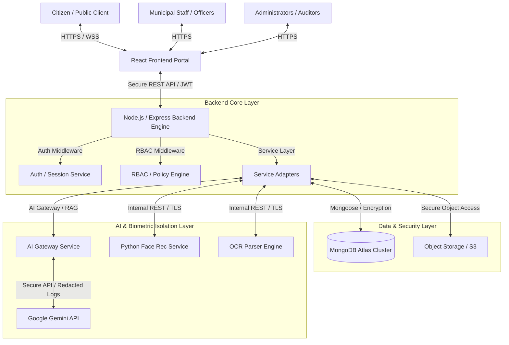
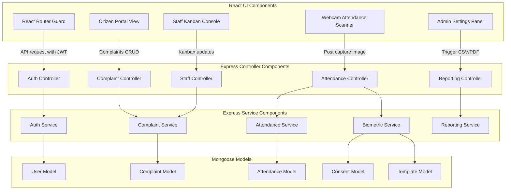
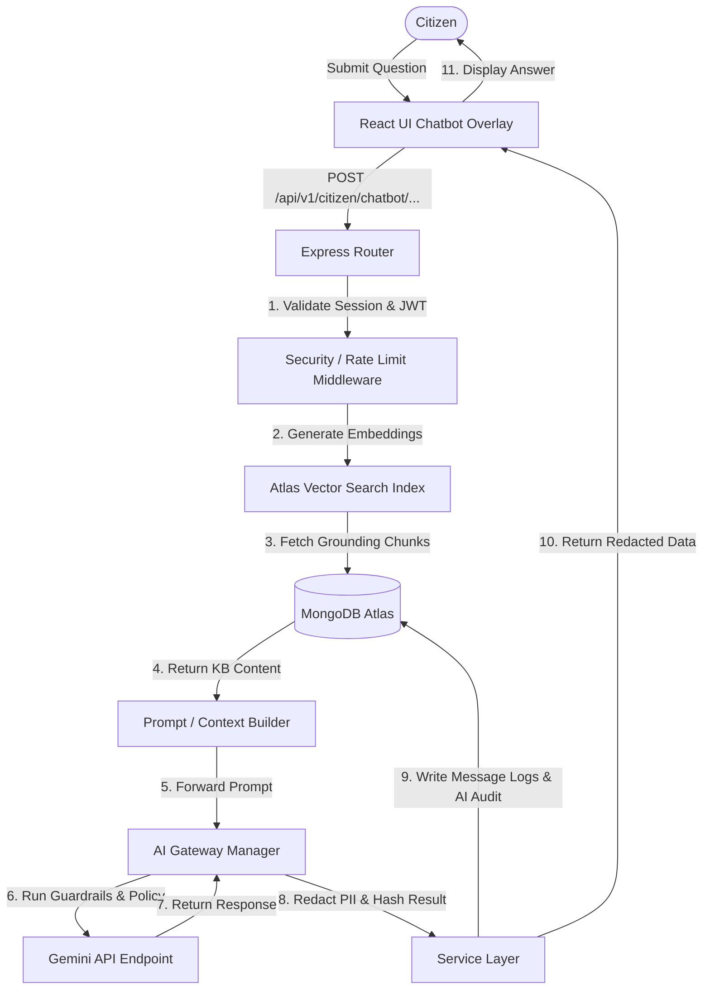
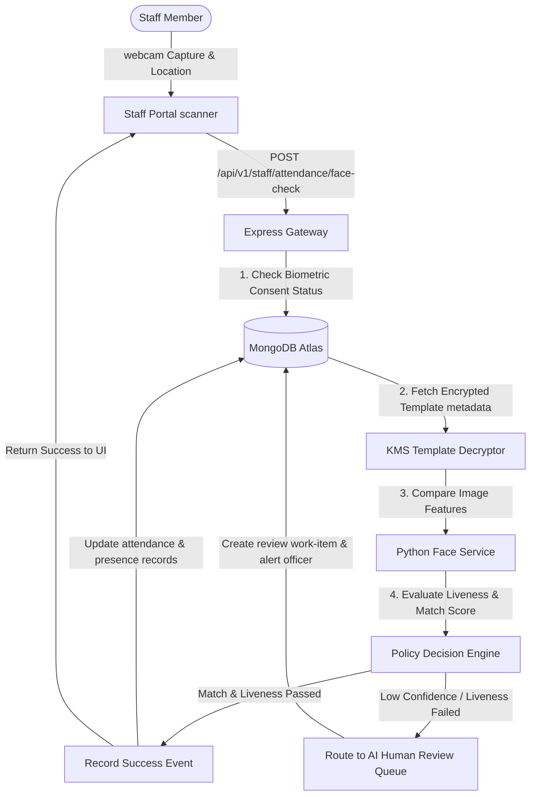
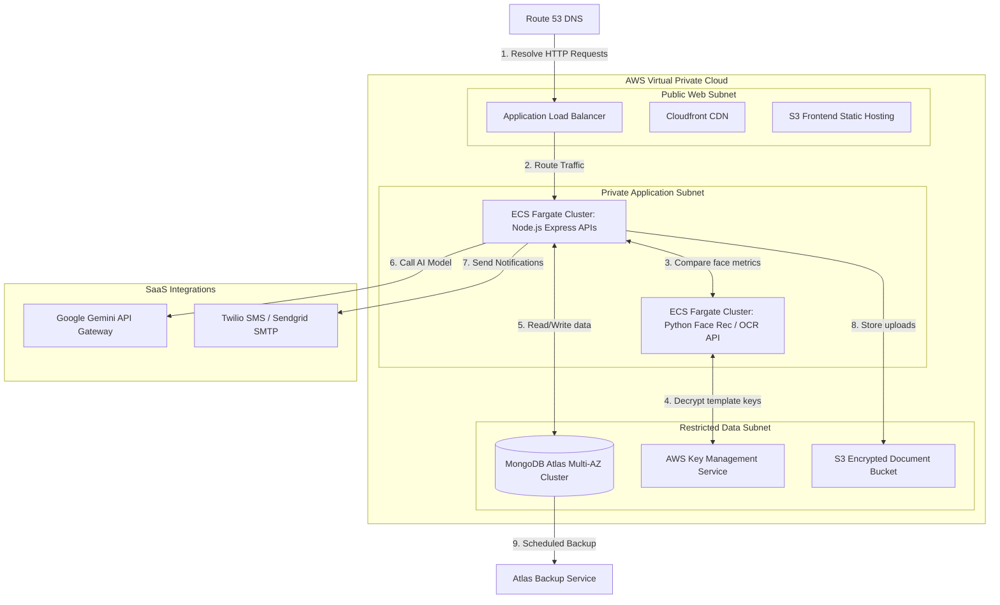

# Master Architecture Document (v1.0)

**Project:** AI-Powered Smart Municipal Citizen Assistance and Staff Attendance Management System  
**Status:** Approved for Development (Architecture Freeze Base)  
**Author:** Principal Enterprise Architect  

---

## 1. Executive Summary

This Master Architecture Document serves as the single authoritative technical blueprint for the **AI-Powered Smart Municipal Citizen Assistance and Staff Attendance Management System**. It consolidates functional requirements, database models, security frameworks, application programming interfaces (APIs), user interfaces (UI), machine learning workflows, and system deployment strategies into a single cohesive reference.

The system is designed to modernize municipal citizen interactions and staff operations by introducing:
1. **AI-Powered Citizen Assistance:** Grounded municipal chatbot (Gemini-backed RAG) for answering citizen queries, providing scheme guidelines, and triaging complaints.
2. **Face Recognition Attendance:** Biometric face template matching and liveness checking to log municipal employee attendance, enforcing consent-based privacy with manual/PIN fallback.
3. **Universal File Tracking:** Public status tracking of applications, certificates, and municipal permits.
4. **Complaint Management Console:** A digital pipeline for citizens to register grievances and for staff to track, assign, resolve, and close tickets.

---

## 2. Project Vision

To establish an agile, transparent, secure, and AI-enabled digital ecosystem for municipal corporations. By leveraging modern cloud infrastructures, natural language processing, and biometric security, the system eliminates operational bottlenecks, reduces human intervention in clerical routing, and guarantees absolute operational traceability.

---

## 3. Business Objectives

* **95% Routing Accuracy:** Eliminate manual complaint assignment errors through automated AI-assisted classification and routing.
* **100% Biometric Traceability:** Modernize staff attendance auditing to prevent buddy-punching, ensuring tamper-proof logs.
* **Zero PII Exposure:** Secure citizen data (specifically Aadhaar duplicates, raw facial images, and private attachments) using robust encryption and strict privacy retention.
* **Under-10-Second Resolution:** Provide immediate public information guidance via chatbot without forcing citizens to visit ward offices.
* **High Availability:** Maintain citizen-facing services under a Same-Business-Day Recovery Time Objective (RTO) and 24-hour Recovery Point Objective (RPO).

---

## 4. Stakeholders

* **Citizens:** General public users who register profiles, interact with the AI assistant, submit grievances, pay municipal taxes/fees, track files, and submit operational feedback.
* **Municipal Staff:** Employees who log attendance via biometric/PIN methods, view assigned complaints on a Kanban dashboard, update timelines, upload proof of work, and receive notifications.
* **Department Officers:** Managers who assign complaints within their departments, audit staff attendance registries, handle escalations from the AI review queue, and generate operational performance metrics.
* **Administrators:** IT personnel who manage users/roles, adjust non-secret system settings, configure SLA rules, and trigger report exports.
* **Municipality IT Team:** System maintainers, database administrators, and security auditors who monitor logs, check backups, and manage credential handovers.

---

## 5. Functional Modules

* **AI Assistant:** Provides RAG-grounded citizen support using Gemini models, answers FAQs, references municipal service directories, and offers chatbot-to-complaint escalation.
* **File Tracking:** Universal tracking dashboard (`file_tracking`) exposing public timelines, current processing stages, and public comments, while hiding internal officer audit logs.
* **Complaint Management:** Grid-based and Kanban consoles managing citizen complaint records (`complaints`), tracking assignments (`complaint_assignments`), history, and resolution files.
* **Feedback System:** Captures ratings, processes citizen comments post-resolution, and locks complaints to prevent modifications after review.
* **Permit & Certificate Services:** Operational metadata and certificate tracking linked to properties, tax files, and payment records.
* **Government Scheme Information:** A public directory exposing municipal schemes, criteria, checklist steps, and downloadable forms.
* **Attendance Management:** Manages consent records (`biometric_consents`), stores encrypted templates, performs liveness verification, tracks daily summaries, and updates a live `staff_presence` cache.
* **Admin Dashboard:** Administrative panels for user roles, department directories, system settings configuration, and raw audit/error log analysis.
* **AI/OCR Services:** Derived processing units that extract metadata from uploaded files (e.g., identity proofs) and perform text categorization.

---

## 6. User Roles & Permissions (RBAC Matrix)

The system enforces a strict Role-Based Access Control (RBAC) matrix. Permissions are defined as:
* **V** (View/Read)
* **C** (Create)
* **U** (Update/Modify)
* **D** (Delete/Remove)
* **A** (Assign / Approve / Oversee)
* **E** (Export)
* **Own** (Limited to user's owned data)
* **Dept** (Limited to user's department)
* **RO** (Read-Only)
* **No** (Access Denied)

| Module / Collection | Citizen | Municipal Staff | Department Officer/Staff | Admin | Super Admin | System Auditor | IT Support Engineer |
| :--- | :--- | :--- | :--- | :--- | :--- | :--- | :--- |
| `users` | V/U Own | V Own | V Dept staff | V/C/U/A | V/C/U/D/A | V RO | V/U support only |
| `roles` | No | No | No | V | V/C/U/D/A | V RO | V RO |
| `permissions` | No | No | No | V | V/C/U/D/A | V RO | V RO |
| `departments` | V public | V | V Dept | V/C/U/A | V/C/U/D/A | V RO | V RO |
| `department_members` | No | V Own membership | V Dept | V/C/U/A | V/C/U/D/A | V RO | V RO |
| `complaints` | V/C Own, U limited | V/U Assigned | V/U/A Dept | V/C/U/A/E | V/A/E | V RO | V metadata only |
| `complaint_assignments` | V Own status | V/U Assigned | V/C/U/A Dept | V/C/U/A/E | V/A/E | V RO | No |
| `complaint_status_history` | V public notes | C/U Assigned | C/U Dept | V/C/U/A/E | V/A/E | V RO | V correlation only |
| `file_tracking` | V public by File ID | V/U Assigned | V/U Dept | V/C/U/A/E | V/A/E | V RO | V metadata only |
| `file_tracking_history` | V public notes | V/C/U Assigned | V/C/U Dept | V/C/U/A/E | V/A/E | V RO | V metadata only |
| `certificates` | V Own | V Assigned | V/U Dept | V/C/U/A/E | V/A/E | V RO | No |
| `certificate_types` | V public | V | V | V/C/U/A | V/C/U/D/A | V RO | V RO |
| `tax_records` | V Own | V Assigned | V/U Dept | V/C/U/A/E | V/A/E | V RO | No |
| `payments` | V Own receipt | V Assigned | V Dept status | V/U/A/E | V/A/E | V RO | No |
| `feedback` | V/C Own | V Assigned | V Dept analytics | V/U/E | V/E | V RO | No |
| `attendance` | No | V Own, C scanner | V Dept, A fallback | V/C/U/A/E | V/A/E | V RO | V errors only |
| `attendance_summary` | No | V Own | V Dept | V/U/A/E | V/A/E | V RO | V RO |
| `staff_presence` | No | V Own status | V Dept dashboard | V/U/A | V/A | V RO | V operational only |
| `biometric_consents` | No | V Own, C revoke | V Dept status | V/C/U/A | V/A/E | V RO | No |
| `face_templates` | No | No direct access | No direct access | V metadata | V metadata/A | V metadata RO | No |
| `knowledge_base` | V public RAG | V permitted | V/C/U Dept drafts | V/C/U/A/E | V/C/U/D/A/E | V RO | V metadata only |
| `kb_embeddings` | No direct access | No direct access | No direct access | V metadata | V/A | V metadata RO | V operational status |
| `chatbot_sessions` | V/C Own | V assigned | V Dept | V/E governed | V/E governed | V RO redacted | V correlation only |
| `chatbot_messages` | V/C Own | V/C handoff | V Dept | V/E redacted | V/E redacted | V RO redacted | V correlation only |
| `ai_human_review_queue` | No | V/U assigned | V/U/A Dept | V/U/A/E | V/A/E | V RO | V operational only |
| `ai_audit_logs` | No | No | V Dept related | V/E | V/E | V RO/E approved | V metadata only |
| `ai_errors` | No | No | V Dept related | V/U status/E | V/E | V RO | V/U operational |
| `notifications` | V/U Own | V/U Own | V/C Dept | V/C/U/A | V/A | V RO | V delivery status |
| `report_exports` | No | No | V Dept metadata | V/C/A/E | V/A/E | V RO | V operational status |
| `system_settings` | No | No | No | V/U non-secret | V/C/U/A | V RO | V/U operational |
| `audit_logs` | No | No | V Dept related | V/E | V/E | V RO/E approved | V metadata only |

---

## 7. High-Level System Architecture

The high-level architecture enforces strict boundaries. No direct writes from client layers or external models are permitted to the MongoDB Atlas backend. All modifications pass through Express controller validation, security middleware, and verified service layers.

---

## 8. Logical Architecture

The backend implements a clear separation of concerns (MVC without direct database coupling in controllers):
1. **Routing Layer (`src/routes/`):** Separates endpoint paths by target audience (public, auth, citizen, staff, admin, ai, internal).
2. **Middleware Layer (`src/middlewares/`):** Pipeline sequence enforcing correlation ID injection, security headers, rate-limiting, JWT authentication, RBAC checks, payload validation, malware scanning, and error handling.
3. **Controller Layer (`src/controllers/`):** Maps HTTP inputs to single service commands. Redacts derived output metadata.
4. **Service Layer (`src/services/`):** Implements business logic, coordinates MongoDB transactions, logs security audit actions, and structures downstream API parameters.
5. **Data Access Layer (`src/models/`):** Mongoose schemas enforcing JSON validation patterns and sparse, unique index rules.

---

## 9. Component Architecture

The component architecture details the boundary configurations of React components, Express controllers, core services, and Mongoose schema models.

* **Web UI Components:** Custom modular React layouts (Citizen Dashboard, Staff Kanban, Admin Configuration panels). Uses client-side routing guards backed by token expiry checks.
* **AI Chat Orchestrator:** Manages conversational memory, fetches document chunks via Atlas Vector Search, parses Gemini responses, enforces output schemas, and updates `chatbot_messages`.
* **Face Comparison Engine:** Python-based module comparing webcam-captured landmarks with active KMS-encrypted facial embeddings. Computes cosine similarity and liveness scores.
* **File Upload Pipeline:** Multi-part parser that intercepts uploads, restricts MIME-types, conducts malware scanning, generates SHA-256 hashes, saves to object storage, and returns a metadata `files` reference ID.

---

## 10. Data Flow Architecture

The data flows ensure structured transaction logs, RAG grounding, and auditability.

### 10.1 Citizen Chatbot & RAG Inquiry Flow

### 10.2 Staff Biometric Face Attendance Flow

---

## 11. Database Architecture Summary

The database uses MongoDB Atlas with a total of **42 collections** (26 preserved production baseline + 16 new support collections):

### Preserved Production Collections (26):
1. `users`: Citizen and employee directory mapping logins, role IDs, and contact info.
2. `roles`: Access-control labels.
3. `permissions`: System action permissions.
4. `departments`: Official municipal divisions.
5. `department_members`: Maps staff accounts to department ownership.
6. `citizen_addresses`: Citizen residency fields.
7. `complaints`: Core grievance tickets storing categorizations, geolocations, and states.
8. `complaint_assignments`: Maps grievance tickets to specific staff/teams.
9. `complaint_status_history`: Historical transition tracker for complaint resolution.
10. `attendance`: Immutable employee check-in/check-out ledger.
11. `attendance_summary`: Monthly and daily aggregation metrics.
12. `properties`: Property tax evaluation database.
13. `tax_records`: Tax bills and balances.
14. `payments`: Payment audit trails.
15. `certificates`: Metadata for municipal permits and forms.
16. `certificate_types`: Permitted certificate blueprints.
17. `files`: Common document registry.
18. `notifications`: Alert delivery logs.
19. `user_notification_preferences`: Settings for SMS, email, or toast messages.
20. `feedback`: Grievance resolution scores.
21. `audit_logs`: Standard administrative mutations.
22. `auth_sessions`: Active user logins.
23. `chatbot_knowledge_base`: Legacy static chatbot references.
24. `wards`: Geospacial municipal boundaries.
25. `complaint_categories`: Allowed classification tags.
26. `sla_policies`: Action deadlines based on severity.

### Added AI & Support Collections (16):
27. `knowledge_base`: Structured RAG knowledge documents with translation and visibility gates.
28. `kb_embeddings`: Vector segments of municipal documents for semantic search.
29. `chatbot_sessions`: Six-month conversation metadata mappings.
30. `ai_human_review_queue`: Review queue for low-confidence AI and biometric events.
31. `biometric_consents`: Legal agreements authorizing facial verification.
32. `face_templates`: Versioned, KMS-encrypted biometric embeddings.
33. `staff_presence`: Read model caching current employee locations and check-in statuses.
34. `file_tracking`: Public timeline tracking index.
35. `file_tracking_history`: Historical milestones for public tracking search.
36. `municipal_service_directory`: Public landing page directory metadata.
37. `announcements`: Citizen alerts and municipal news listings.
38. `password_reset_tokens`: TTL-expired hashes for public password resets.
39. `report_exports`: Grid metadata for admin data requests.
40. `system_settings`: System configurations and non-secret pointers.
41. `ai_errors`: System failure logs detailing error scopes and fallbacks.
42. `ai_audit_logs`: Append-only, time-series logs tracking AI activities.

---

## 12. API Architecture Summary

APIs are routed through a versioned structure (`/api/v1/`) separated by access scope:

### Public Module:
* Announcements lookup and landing announcements: `GET /api/v1/public/announcements`
* Schemes and service index: `GET /api/v1/public/service-directory`
* Public file progress tracking: `GET /api/v1/public/file-tracking/:fileNo`
* Registration, Login, and Password resets: `/api/v1/auth/register`, `/api/v1/auth/login`, `/api/v1/auth/password-reset/...`

### Citizen Module:
* User profile editing: `GET/PATCH /api/v1/citizen/profile`
* Notification selections: `GET/PATCH /api/v1/citizen/notification-preferences`
* Ticket creation and retrieval: `POST/GET /api/v1/citizen/complaints`
* Chatbot interaction: `POST /api/v1/citizen/chatbot/sessions`

### Staff Module:
* Kanban assignments: `GET/PATCH /api/v1/staff/assignments`
* Timeline modifications and uploads: `POST /api/v1/staff/complaints/:complaintNo/timeline`
* Biometric scanning endpoints: `POST /api/v1/staff/attendance/face-check`
* Manual check-in override: `POST /api/v1/staff/attendance/manual`

### Admin Module:
* User controls and role audits: `GET/POST/PATCH /api/v1/admin/users`
* Department creation: `GET/POST /api/v1/admin/departments`
* Global ledgers and CSV/PDF downloads: `POST /api/v1/admin/reports/exports`
* System setting changes: `PATCH /api/v1/admin/system-settings/:settingKey`

### AI & Internal Modules:
* Grounded response creation: `POST /api/v1/internal/ai/gemini/respond`
* Face comparisons: `POST /api/v1/internal/face/verify`
* Retention cleanups: `/api/v1/internal/jobs/...-cleanup`

---

## 13. Security Architecture Summary

* **Authentication:** JWT tokens containing minimal claims combined with server-side `auth_sessions` state verification.
* **Authorization & RBAC:** Enforced at backend gateways checking user permissions, department memberships, and object ownership before controller executes.
* **Data Encryption:** TLS 1.3 in transit. AES-256 field-level encryption for sensitive records, plus KMS envelope encryption for biometric embeddings.
* **Audit Logging:** Append-only database collections (`audit_logs`, `ai_audit_logs`) tracking administrative configurations, role adjustments, report downloads, and biometric consent changes.
* **Threat Protection:** Rate limit throttles, anti-NoSQL query validation middleware, and bot detection parameters (CAPTCHA) on public pathways.

---

## 14. AI Architecture Summary

* **Chatbot:** Grounded RAG architecture utilizing Atlas Vector Search to locate documentation chunks before generating a response.
* **OCR Services:** Assists citizens in document processing, parsing uploaded PDFs, extracting data fields, and saving outputs as restricted derived files.
* **Face Recognition:** Uses liveness verification checks to confirm three-dimensional depth, comparing facial vectors against active KMS templates.
* **Human Review Flow:** Intercepts failures, routing low-confidence matches, failed liveness checks, chatbot ticket escalations, and manual fallback requests into `ai_human_review_queue`.

---

## 15. Deployment Architecture

The production environment maps resources across isolated network boundaries in a Multi-AZ Virtual Private Cloud (VPC).

---

## 16. Backup & Disaster Recovery Summary

* **Database Backups:** Daily encrypted snapshots managed via MongoDB Atlas, including backup immutability rules and multi-factor authentication (MFA) requirements to prevent malicious deletion.
* **RPO & RTO Guidelines:** Core citizen portals utilize a Same-Business-Day recovery objective. Highly critical endpoints (like financial collections and attendance punches) require structured, priority-tiered recovery targets.
* **Restore verification:** Automated recovery verification schedules that restore database fragments in private staging sandboxes, validating schema indexing and logging test metrics.

---

## 17. Privacy & Compliance Summary

* **Aadhaar Protection:** Raw identification numbers are never saved. Registration queries normalized and convert data into cryptographic PBKDF2/SHA-256 hashes (`users.aadhaar_hash`) to avoid duplicate records.
* **Biometric Consent Lifecycle:** Enforces explicit permission rules (`biometric_consents`) prior to face templates activation. Staff retains the right to withdraw consent, initiating biometric template deletion workflows.
* **Redaction Policy:** Chat logs are parsed, stripping sensitive numbers, credentials, and personal information before storage in the database.
* **OCR Output Handling:** Derived document parsing data is stored under restricted metadata permissions, and transient files are deleted after completion.

---

## 18. Municipality Handover Strategy

A controlled, document-verified transition plan to transfer system control to municipal IT teams:
1. **Infrastructure Provisioning:** Recreate database clusters, storage buckets, and server configurations under municipal accounts.
2. **Credential Handover:** Perform secure credential transfers, rotating development database logins, removing staging access tokens, and changing KMS master keys.
3. **Personnel Training:** Admin interface training for municipal administrators, and manual fallback review training for department officers.
4. **Acceptance Verification:** Verify backup restoration processes and operational sign-off from municipality managers.

---

## 19. Scalability Strategy

* **Read Optimization:** Cache configurations using read models (e.g., `staff_presence` for live dashboards) to avoid high-volume database queries.
* **Sharding & Indexing:** Configure compound database indices matching common queries (e.g., department search, citizen query categories) and partition logs into MongoDB time-series structures.
* **Decoupled API Gateways:** Use isolated node clusters for AI integrations, ensuring chatbot usage spikes do not impact core complaint intake channels.

---

## 20. Future Enhancements

* **MFA for Admins:** Implement multi-factor validation (such as TOTP or WebAuthn) for high-risk actions like role adjustments or export requests.
* **Offline Attendance Capabilities:** Edge processing models that allow local kiosks to buffer attendance records during network outages.
* **Cross-Municipal Analytics:** Federated learning models mapping regional grievance trends to assist state-level resource planning.
